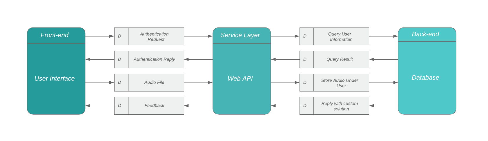
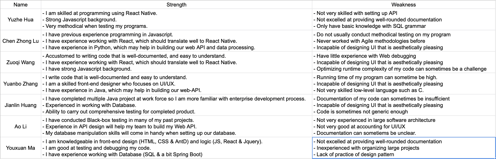

# Sick Kids
> _Note:_ This document is meant to evolve throughout the planning phase of your project.    
 > That is, it makes sense for you commit regularly to this file while working on the project (especially edits/additions/deletions to the _Highlights_ section).
 > Most importantly, it is a reflection of all the planning you work you've done in the first iteration.
 > **This document will serve as an agreement between your team and your partner.**

## Product Details

#### **Q1: What are you planning to build?**

This product is a mobile application that allows patients to remotely send audio
recordings of urinary voids to the hospital, where it will be received by
doctors and analyzed. This app will be deployed on both Android and iOS
platforms.

Currently, patients use medical equipment known as a uroflowmeter to produce
graphs outlining their ability to empty their bladder. This equipment can be
expensive and is not widely available outside of urologist offices and
hospitals. To increase accessibility and reduce the cost of equipment, the
Urology department at SickKids is attempting to develop technology that will
allow the diagnosis of urinary voiding conditions without a visit to the
hospital.

The proposed technology is that the patient will, using their mobile device,
record the sound of themselves/their child voiding. This audio data will be
relayed to the hospital and mapped to a urinary flow model built by SickKids so
that a prediction of the patient’s voiding condition can be made. If further
actions are needed, the doctors can then conduct an in-person appointment with
the patient.

Helpful Links: <https://www.healthline.com/health/uroflowmetry>

#### **Q2: Who are your target users?**

The user group will consist initially of pediatric patients with voiding conditions such as urethral strictures and meatal stenosis. This technology may eventually be translated for use in adult patients with urinary voiding conditions. 

Doctors who will be needing the user-submitted information are also considered as a part of the target users.

#### **Q3: Why would your users choose your product? What are they using today to solve their problem/need?**

This product has not been built before. This product will reduce the patient’s
frequency of visits to the hospital. For patients living in remote areas, this
will be a very convenient alternative. There is potential for significant
patient and healthcare system cost savings.

#### **Q4: How will you build it?**

The app will be built using React Native, this is to ensure the product’s
compatibility on both Android and IOS platforms. The application will use a
front-end structure that will be built to interact with the existing database
and servers provided by Sick Kids. This app will be written in JavaScript. React
Native, Expo and Feather.js will be used in the app. Front-end scripting logic
will be completed by JS, including sending and receiving HTTP requests to and
from API. Feather.js will be used to build a custom API that responds to such
requests as well as reading and saving to Sick Kids databases. This app will be
tested both with Jest and on physical devices including both Android and iOS.
Expo will enable us to carry out such testings.  

The application will be deployed in the App Store and Google Play Store, where
they can be downloaded by all users but only those authorized will have access
to its full functionality.

#### **Q5: What are the user stories that make up the MVP?(Updated for remark version)**
**Come back tmr to complete!!!**
1. As a patient using this app, I want to be able to log into this application, so that I can use full functionality of this app.
(User are all predefined on the Sickkids side)

2. As a patient that has logged in, I want to be able to view my history voiding recordings on the HomePage, so that I can do various action on each recordings.

3. As a patient, I want to be able to send my recording to my doctor for evaluation, so that I can acquire feedbacks on my health condition from doctor.

4. As a patient, I want to be able to delete my history recording on my wish, so that I can either free up space on my cell phone, or delete an unsatisfied recording.

5. As a patient, I want to be able to create new recording so that I can save it or preview it. 

6. As a patient, I need to be able to view/update my basic information so that my information in the system.

   
**Accepting Criteria**

1. In order to validate user requesting to log in, an request to connect to the user database, and search for requested user name and send back status. If existed, check the password, if correct, allow user to log into this application, if wrong password was entered, prompt for another try; if user not existed, also prompt accordingly.

2. To view a specific user's recording history:
    - Request send to database for fetching user's data
    - Get all recordings from a specific user entry

3. In order for a user to send recording to doctor:
    - A .wa4 type file needs to be stored locally to send 
    - A connection request must be set up using API calls
    - The device needs to communicate with a provided server within an resonable time

4. To delete a specific recording from history:
    - A specific recording must be indicated for deletion
    - Access to phone storage needs to be granted
    - Able to remove speficied audio file locally

5. To create a new recording:
    - Access to phone storage must be granted
    - Access to phone's microphone needs to be allowed
    - Need to able to stop the recording process
    - The generated audio file should be able to be replayed

6. To make changes to profile information:
    - Able to access user database, to fetch user information from the database
    - Able to send update request to the database as user make changes to the information

**Process Details**
-------------------
**Strength and Weakness**

#### **Roles & responsibilities**

-   Yuzhe Hua

    -   I will be using React Native to design front-end functionalities of our application for both Android and Apple platform, which as per our clients expectation of this project; implementing required features such as recording/ saving/ send the audio files. I will also be responsible for client-end API development, for example, sending and storing the target files into our partner's database. I will also be conducting tests as this project moves along in order to deliver a working product for each phase.

-   Chen Zhong Lu

    -  I will be responsible for using React Native to develop front-end functionalities such as recording audio, saving audio record, and sending the audio to our API for processing. I will also take part in developing an API that handles client-end audio files and save them into a local database.

-   Zuoqi Wang

    -   I will be using React Native to design front-end functionalities of our application for both Android and Apple platform, which as per our clients expectation of this project; implementing required features such as recording/ saving/ send the audio files. I am also responsible for back-end integration towards the end of the project mainly for deployment. I will also be responsible for client-end API development, for example, initiating request to our partner's database.

-   Yuanbo Zhang

    -   I will be taking part in developing front-end functionalities of our program in React Native. I will also be integrating the front-end functionalities with our web API. I will also help with integrating our API with the deployment environment at Sick Kids.
    
-   Jianlin Huang

    -   I will be using React Native to design front-end features and presentation of our application for both Android and Apple platform, which as per our clients expectation of this project. As needed, I will also be responsible for client-end API development, for instance, sending and storing audio files into our partner's database (with encryption if possible). I will also be doing documentation of our project which including taking meeting minutes; as well as potentially integrating this application into partner's server or database.

-   Ao Li

    -   I will be developing front-end components in React Native. I will also participate in coding the client-end web API. If needed, I will be integrating our program with Sick Kids’ provided database to ensure compatibility.

-   Youxuan Ma

    -   I will be responsible for front-end development in React Native. I will also be involved in developing the web API that will be used for client-database interaction. Towards project completion, I will be writing and conducting tests.

#### **Team Rules:**

#### **Communications:**

-   CSC301 project team will meet with Sick Kids on a weekly basis, either in person or online. In these meetings, the team will give an update on our development progress. If there are new features pushed, we will desmonstrate these features to Sick Kids representatives using Expo as a simulator. We will log feedbacks, and adjust the application accordingly. 

-   CSC301 team will aim to have as many of its members in attendance at the meeting as possible. Should a member fail to be present at a meeting with Sick Kids, a legitmate reason for absence will be provided.
    
-   The team will, to the best of their ability, ensure that all commits to the master branch are clear, so that should a TA or professor wish to review our work, they will be able to do so easily. The team will also aim to notify the TA and professor as soon as possible if any unforeseen incidents occur and require special accomodation.

#### **Meeting:**

-   CSC301 project team will meet internally on a weekly basis where Sick Kids requirements will be completed following the Agile workflow. We will iterate through tickets, where each ticket represents a stage in the project's completion. These tickets will be set up according to Sick Kids requirements and Sick Kids representatives will be updated upon ticket completion.

-   In these meetings, a ticket will be divided into sections by features and sub-features, which will be assigned to subsets of CSC301 team.

-   For every weekly meeting, progress updates will be given and new
    responsibilities will be assigned, iterating overall progress.
    
-   All meetings will be logged in our google drive folder.

#### **Conflict resolution:**

-   In the case of indecisions, the team will vote with no abstention, and the
    majority vote will be passed.

-   In the event of one of team members not completing assigned tasks with sufficient quality or within the deadline with no advanced notice or legitmate excuse, the group will conduct a discussion session with that individual. If no progess is made, this event will be logged and reported to TA during tutorial given unanimous consent from the team.

-   Resolve conflicts with LOVE and PEACE.

#### **Events**

-   The team will meet in person, in Bahen if possible. If not, another suitable
    location will be chosen.

-   These meetings will consist of coding sessions, code reviews, connecting
    functionalities of different components (ex. Connecting Feathers.js and
    front-end code) and overall status updates.

-   Meetings will happen weekly.

#### **Partner Meetings:**

-   Partner meetings will happen in person, at a Sick Kids approved location,
    where at least a majority of team members will be present.

-   In the first two meetings we have:

    -   Clarified the app’s functionalities from both a technical and
        non-technical perspective

    -   Decided the teach stack components (see: Q4 How will you build it?)

    -   Decided on development priorities:

        -   First, complete the functionalities of recording and sending
            user-recorded audio files to Sick Kids database (complete JS and API
            functions to support this feature)

        -   Then, complete user authentication processes.

        -   Lastly, complete UI components (refine HTML and CSS layout)

#### **Artifacts**

-   Create a GitHub repository where project source code and project management documents are hosted online. Also team members can create, modify, discuss and track project issues with GitHub issues.
    - Link: <https://github.com/csc301-fall-2019/team-project-sickkids-team>

-   Create a google drive folder shared among internal developers for documenting meeting contents, email conversations and to-do lists roughly resembling project roadmap.
    - Link: <https://drive.google.com/drive/folders/1ka4E3q3dlAuWNzbk3f0TR9FbCGFXt1W5?usp=sharing>

-   Create a Slack channel where team members and Sick Kids representatives are invited in to discuss and technical issue or management questions in order to minimize communication delay.
    - Link: <https://sickkidsuroflow.slack.com>

**Highlights**
--------------

-   If anything noteworthy comes up, we will make sure to add them here.
