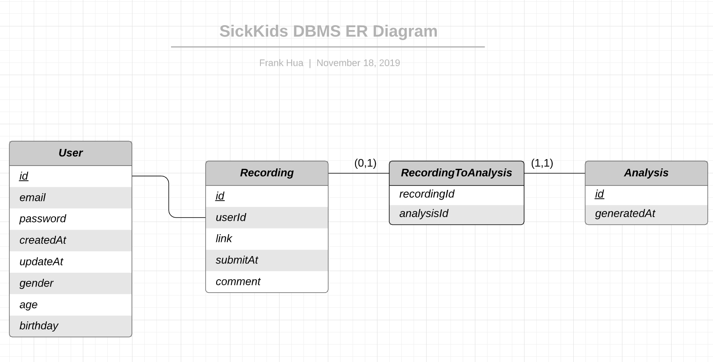

# CSC301 Deliverable 2 Part 2 -- Iteration-02
# Sickkids Project Team#23
   
 > _Suggestion:_ Have your review meeting a day or two before the due date. This way you will have some time to go over (and edit) this document, and all team members should have a chance to make their contribution.

## Iteration 02 - Review & Retrospect

 * When: November 15th
 * Where: Peter Gilgan Centre for Research and Learning, 686 Bay St.

## Process - Reflection

In this process iteration, we made a huge progress regarding our most significant feature of our application -- recorder. We are able to utlize the recording library from react native as well as learning from sample code to implement our recorder as needed. Also we were able to create an complete front-end framework.

#### Decisions that turned out well

List process-related (i.e. team organization) decisions that, in retrospect, turned out to be successful.
* Clarify partner's need and requirement before actually implementation
    - During the process of development, we scheduled our meetings with our partner almost every week; and we deliver or altered features/product according to last meeting's tasks and feedbacks. This workflow follows the standard Agile development method, which we find helps us having clear understanding of the requirements and be flexible with changing needs of our partner.
* Using Git issues
    - Deciding to switch to Git issues as a more comprehensive and convievient way of keeping track of the tasks we need complete is a one of the wise decision we made. We now have a better visualization of the tasks assignees, priority and any comments/detailed message along with the tasks, which enables us to work more smoothly. 
        > Git issues could be found in our project repository
* Creating a slack channel
    - We create a slack channel which involves every members of our project team as well as our partner's side. This allows us to communicate with them in a more efficient method rather than email back and forth when it comes to us having any technical difficulties.  
        > Link to our Slack Channel: https://app.slack.com/client/TPRD8J95Z/CPQ409N7

<!-- Frank's note: 
we contacted SickKids' internal software developer Dorin, he gave us some great tips and tools to help us moving forward. 
Also, we  -->

#### Decisions that did not turn out as well as we hoped

List process-related (i.e. team organization) decisions that, in retrospect, were not as successful as you thought they would be.
 - Developing frontend before backend
     - At the initial stage of project, we chose frontend in favor of backend in spite of the suggestion of contrary from SickKids developers. We spent too much time on polishing frontend experience and currently we are overwhelmed with learning backend developing. There are plenty of documentation avaliable online yet time constraint has become tighter.
 - Lack of asking for assistance
     - Throughout the developing process we have not asked for any help from TAs or instructors. We handled the frontend part rather well yet the backend is far more trickier than we thought. This is a major cause of our slow progress on backend developing.

<!-- Frank's note: 
we could have use more help from our TAs and instructors.
Develop front-end first before develop back-end was a bad decision, because at the moment we have finish most of our front-end structures while back-end API has little to no progress at all.  -->

#### Planned changes

List any process-related changes you are planning to make (if there are any):

 Communicate with SickKids via Slack channel more frequently since a majority of clients has joined the channel.
 We will also try to ask more help from TA's and instructors. Maybe schedule a meeting with one of our TA? 

## Product - Review

#### Goals and/or tasks that were met/completed:

 
 **First goal(most urgent):**
 - We have implemented and altered front-end design to ensure the smoothest user experience. We completed 4 pages: Login Page, History Page (landing page), Record Page, and Profile Page. Login Page is displayed upon app startup and the rest of the pages can be accessed via the navigation bar at the bottom of the screen after logging in.
 - The layouts and the user flow between these pages are revised by our partners in all of our meetings and are constantly updated. The current deployed version of the app contains changes made according to requirements given by Sick Kids partners prior to (not including) the meeting on Nov 15th.

 - Login Page:
     - By clicking on the "login" button glowing in blue, the app can now redirect user to the landing page and grant them access to the app's full features.
     - The front-end of this page was completed to the expected layout which is minimalist, but functional.

 - History Page:
     - This page is successfully set as the landing page upon log in.
     - This page displays user recordings. Each of these recordings respond to click events and open up a new page, showing their details.
     - Each recording's page display decording information such as the id and the page implmented functionalities to delete that recording via button click. This deletion will also update the corresponding log displayed on History Page. Button "send to my doctor" respond to click events but, with API not yet implemented, this function has no functionality.

 - Recording Page:
     - This page has an intuitive layout with components needed to record/end recording, playback, and adjust volume.
     - Clicking on "microphone" icon will start the recording and clicking it again after recording starts will end the recording session.
     - After recording, playback is enabled. "start" and "button" respond to click events and functions accordingly.
     - Dragging the progress bar of the recording will play the audio file at the corresponding time stamp.
     - Volume can be adjusted by dragging the volume bar and muted/unmuted by pressing the "volume" icon.
     - Result Page (a subpage of Recording Page) is merged into this page to simplify user flow.

- Profile Page:
    - This page displays user information in clear, minimalist layout.
    - Pressing on information fields (such as username and birthday) will enable the editing function of of these fields.
    - A "log out" button is placed here to redirect the user back to Login Page.

**Second goal(realtivly urgent):**
- expo-av library is used to achieve the recording and playback functionality.
- In the first launch of the app, user will be asked to give permission for the app to access microphone.
- With microphone permission enabled, the full recording and playback functionality 
- User can navigate to this page via navigation bar.
- The complete functionalities of this page are described in "Record Page" section in First Goal.

**Third goal(tentitive goal):**
 - We have revised database schema structure with our partners.
 - A database schema is created to store authenticated user information and audio files
  

#### Goals and/or tasks that were planned but not met/completed:

 * From most to least important.
 * For each goal/task, explain why it was not met/completed.      
   e.g. Did you change your mind, or did you just not get to it yet?
   
   We didn't create our back-end API yet in our app. Part of our team try to construct the back-end server using docker & feathers.js, but it turns out these tools are more complicated than what we thought. So we decide to have a conversation with SickKids' software developer on back-end API before we write any code. This is scheduled to take place on the morning of Nov 22nd.
   
   We did't implement the feature which let our user to save the recording locally. We are encountering the challenge that, for Android and IOS, the audio files are encoded differently. Unfortunetely we did not have enough time to get it done. We will hopefully get it done by next iteration. 

#### How was your product demo?
 * How did you prepare your demo?
 We deployed the demo of the app onto the Expo platform
 https://expo.io/@falanke/uroflow, where the customer may view the app demo by log in with our pre-defined username.  
 We have created a slack channel for the partners to join and discuss. 
 
 * What did you manage to demo to your partner?
 We managed to demonstrate all available funtionalities of our front-end app such as:
     1. **Log in** features
     2. **Recording History** modifications
     3. **Record From Your Phone** this app now let you record sound from the phone's native microphone.
     4. **Profile Page** where you can view and change your personal information such as password, gender or birthday etc.
     ...
     
    
   We also gave them a template of our designed back-end database schema. 
    
 * Did your partner accept the features?
 The partner adviced us some additional database fields in the recording table. Besides that, the partner was satisfied with what we've done and is looking forward to see the final version of the app by the end of the semester. 
 
 * Were there change requests?
 The partner adviced some additional database fields in the recording table. The additional database fields includes a list of symptoms that they want the user able to send alongside their recording data. Users should be able to use checkboxs to inform doctors when symptoms happen during a recording.
 The partner also requests us to change the Record page to be the launch page after the user logs in. 
 Updated database schema: 
 
 
 * What did you learn from the demo from either a process or product perspective?
 Always make the database schema easy-extendable, new fields usually came up as we develop the application. 
 Communicate with the customer and ask them advices before we build the database. 
 The customers usually can come up with new feature requests during the demo, which means demos are necessary, it captures what the customers really want in a more specific way. 

## Meeting Highlights

Going into the next iteration, our main insights are:

1. Primarily complete the database schema with client provided additional details. Also keep the design open for extension due to possible new requirements.
2. Design a server side API which incoporates with frontend function requirements. Particularly consisting of authentication, recording transfer and retrival.
3. Determine an approperiate approach of managing audio file both on client-side and server-side. In the best case it should fit well with current database.
4. Complete given frontend requirement modifications. This mainly consists of four parts:
    - Clinical background information collection for each recording
    - Independent recording and playback functionalities in recording workflow
    - Playback functionality on history page, caching of recent recording possibly
    - Change landing page from history page to record page for quicker recording workflow
 
<!--  Back-end api integration
 Database connection
 Phone local history recording audio file replay
 Recording and playback separation -->
